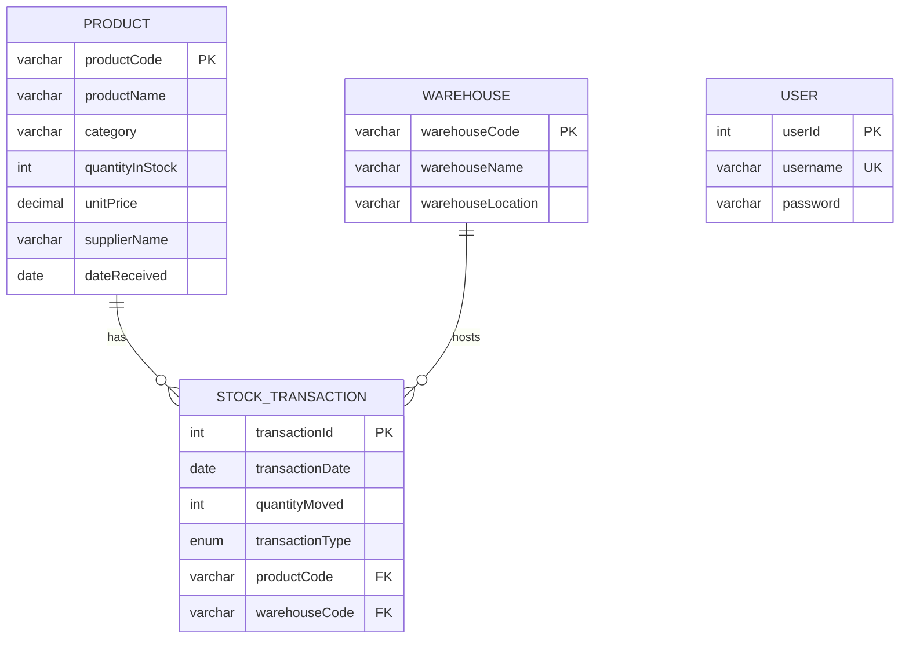

# Stock Management System (SMS) — Entity Relationship Diagram

**StockHub Ltd** — Kigali City, Rwanda

## Entities & Attributes

| Entity | Primary Key | Attributes |
|--------|-------------|------------|
| **Product** | `productCode` | productName, category, quantityInStock, unitPrice, supplierName, dateReceived |
| **Warehouse** | `warehouseCode` | warehouseName, warehouseLocation |
| **StockTransaction** | `transactionId` | transactionDate, quantityMoved, transactionType, productCode (FK), warehouseCode (FK) |
| **User** | `userId` | username, password (hashed) |

## Relationships & Cardinalities

```
Product (1) ────────< (M) StockTransaction
Warehouse (1) ──────< (M) StockTransaction
```

- One **Product** can appear in many **StockTransactions**.
- One **Warehouse** can host many **StockTransactions**.
- Each **StockTransaction** belongs to exactly one Product and one Warehouse.

## Crow's Foot Notation (for draw.io / Lucidchart)

Draw three rectangles (entities) and two identifying relationships:

1. **RECORDS** — between Product and StockTransaction (1:N)
2. **OCCURS_AT** — between Warehouse and StockTransaction (1:N)

Symbols:
- Product side: `||` (exactly one)
- StockTransaction side: `o<` (zero or many)

## Mermaid ERD (for documentation)



## Foreign Keys

| Child Table | FK Column | References |
|-------------|-----------|------------|
| StockTransaction | productCode | Product(productCode) ON DELETE RESTRICT |
| StockTransaction | warehouseCode | Warehouse(warehouseCode) ON DELETE RESTRICT |

## Business Rules

- `transactionType` ∈ { `STOCK_IN`, `STOCK_OUT` }
- On **STOCK_IN**: increase `Product.quantityInStock` by `quantityMoved`
- On **STOCK_OUT**: decrease `Product.quantityInStock` (reject if insufficient stock)

---

*Draw the ERD on plain paper first, then replicate in draw.io, Lucidchart, or Edraw Max using Chen/Crow's Foot symbols as required by your examiner.*
